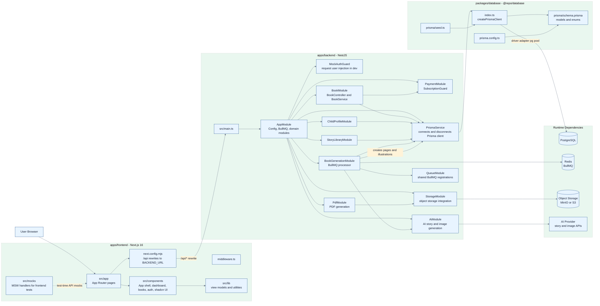
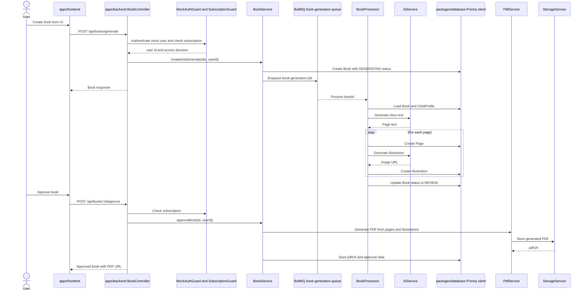
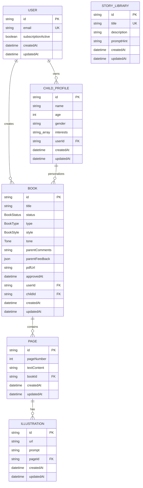

# Project Directory Architecture

Mermaid diagrams for the three primary project directories:

- `apps/frontend` - Next.js 16 application
- `apps/backend` - NestJS API and background workers
- `packages/database` - Prisma schema and client factory

## Runtime Containers

## Main Book Flow

## Database Model

## Combined Export View

Single Mermaid block for export in Mermaid Live Editor. This uses one `flowchart`
because Mermaid does not allow `flowchart`, `sequenceDiagram`, and `erDiagram`
syntax to be mixed inside the same diagram block.

```mermaid
---
config:
  theme: base
  themeVariables:
    primaryColor: "#e8f4ff"
    primaryBorderColor: "#1b4d89"
    primaryTextColor: "#172033"
    secondaryColor: "#fff3d8"
    tertiaryColor: "#e9f7ef"
    lineColor: "#667085"
---
flowchart TD
    Browser["User Browser"]

    subgraph Frontend["apps/frontend - Next.js 16"]
        Middleware["middleware.ts"]
        AppRoutes["src/app<br/>App Router pages"]
        UIComponents["src/components<br/>App shell, dashboard, books, auth, shadcn UI"]
        FrontendLib["src/lib<br/>View models and utilities"]
        MSW["src/mocks<br/>MSW handlers for frontend tests"]
        NextConfig["next.config.mjs<br/>/api rewrites to BACKEND_URL"]
    end

    subgraph Backend["apps/backend - NestJS"]
        Main["src/main.ts"]
        AppModule["AppModule<br/>Config, BullMQ, domain modules"]
        Auth["MockAuthGuard<br/>Request user injection in dev"]
        BookModule["BookModule<br/>BookController and BookService"]
        ChildProfileModule["ChildProfileModule"]
        StoryLibraryModule["StoryLibraryModule"]
        PaymentModule["PaymentModule<br/>SubscriptionGuard"]
        GenerationModule["BookGenerationModule<br/>BullMQ processor"]
        AiModule["AiModule<br/>AI story and image generation"]
        PdfModule["PdfModule<br/>PDF generation"]
        StorageModule["StorageModule<br/>Object storage integration"]
        QueueModule["QueueModule<br/>Shared BullMQ registrations"]
        PrismaService["PrismaService<br/>Connects and disconnects Prisma client"]
    end

    subgraph DatabasePackage["packages/database - @repo/database"]
        PrismaFactory["index.ts<br/>createPrismaClient"]
        PrismaSchema["prisma/schema.prisma<br/>Models and enums"]
        Seed["prisma/seed.ts"]
        PrismaConfig["prisma.config.ts"]
    end

    subgraph External["Runtime Dependencies"]
        Postgres[("PostgreSQL")]
        Redis[("Redis<br/>BullMQ")]
        ObjectStorage[("Object Storage<br/>MinIO or S3")]
        AIProvider["AI Provider<br/>Story and image APIs"]
    end

    subgraph BookFlow["Main Book Flow"]
        FlowCreate["1. User creates book in UI"]
        FlowGenerate["2. POST /api/books/generate"]
        FlowGuard["3. MockAuthGuard and SubscriptionGuard<br/>authenticate and authorize"]
        FlowCreateBook["4. BookService creates Book<br/>with GENERATING status"]
        FlowQueue["5. Enqueue book-generation job"]
        FlowWorker["6. BookProcessor loads Book and ChildProfile"]
        FlowStory["7. AiService generates story text"]
        FlowPages["8. For each page<br/>create Page, generate illustration, create Illustration"]
        FlowReview["9. Update Book status to REVIEW"]
        FlowApprove["10. User approves book<br/>POST /api/books/:id/approve"]
        FlowPdf["11. PdfService generates PDF"]
        FlowStore["12. StorageService stores PDF"]
        FlowApproved["13. Save pdfUrl and approval data"]
    end

    subgraph DataModel["Database Model"]
        UserModel["USER<br/>id PK<br/>email UK<br/>subscriptionActive<br/>createdAt<br/>updatedAt"]
        ChildProfileModel["CHILD_PROFILE<br/>id PK<br/>name<br/>age<br/>gender<br/>interests<br/>userId FK"]
        BookModel["BOOK<br/>id PK<br/>title<br/>status BookStatus<br/>type BookType<br/>style BookStyle<br/>tone<br/>parentComments<br/>parentFeedback<br/>pdfUrl<br/>approvedAt<br/>userId FK<br/>childId FK"]
        PageModel["PAGE<br/>id PK<br/>pageNumber<br/>textContent<br/>bookId FK"]
        IllustrationModel["ILLUSTRATION<br/>id PK<br/>url<br/>prompt<br/>pageId FK"]
        StoryLibraryModel["STORY_LIBRARY<br/>id PK<br/>title UK<br/>description<br/>promptHint"]
    end

    Browser --> AppRoutes
    Middleware --> AppRoutes
    AppRoutes --> UIComponents
    UIComponents --> FrontendLib
    AppRoutes --> NextConfig
    NextConfig -->|"/api/* rewrite"| Main
    MSW -. "test-time API mocks" .-> AppRoutes

    Main --> AppModule
    AppModule --> Auth
    AppModule --> BookModule
    AppModule --> ChildProfileModule
    AppModule --> StoryLibraryModule
    AppModule --> PaymentModule
    AppModule --> GenerationModule
    AppModule --> AiModule
    AppModule --> PdfModule
    AppModule --> StorageModule
    AppModule --> PrismaService
    GenerationModule --> QueueModule
    GenerationModule --> Redis
    BookModule --> PaymentModule
    BookModule --> PrismaService
    ChildProfileModule --> PrismaService
    StoryLibraryModule --> PrismaService
    GenerationModule --> PrismaService
    GenerationModule --> AiModule
    PdfModule --> StorageModule
    StorageModule --> ObjectStorage
    AiModule --> AIProvider

    PrismaService --> PrismaFactory
    PrismaFactory --> PrismaSchema
    PrismaFactory -->|driver adapter pg pool| Postgres
    PrismaConfig --> PrismaSchema
    Seed --> PrismaFactory

    FlowCreate --> FlowGenerate --> FlowGuard --> FlowCreateBook --> FlowQueue
    FlowQueue --> FlowWorker --> FlowStory --> FlowPages --> FlowReview
    FlowReview --> FlowApprove --> FlowPdf --> FlowStore --> FlowApproved

    FlowGenerate -. "handled by" .-> BookModule
    FlowGuard -. "uses" .-> Auth
    FlowCreateBook -. "writes" .-> BookModel
    FlowQueue -. "uses" .-> QueueModule
    FlowWorker -. "runs in" .-> GenerationModule
    FlowStory -. "uses" .-> AiModule
    FlowPages -. "writes" .-> PageModel
    FlowPages -. "writes" .-> IllustrationModel
    FlowPdf -. "uses" .-> PdfModule
    FlowStore -. "uses" .-> StorageModule
    FlowApproved -. "updates" .-> BookModel

    UserModel -->|owns| ChildProfileModel
    UserModel -->|creates| BookModel
    ChildProfileModel -->|personalizes| BookModel
    BookModel -->|contains| PageModel
    PageModel -->|has| IllustrationModel
    StoryLibraryModel -. "independent catalog table" .-> BookModel
```

## Notes

- `apps/frontend/next.config.mjs` rewrites `/api/:path*` to the backend URL, so browser-facing API calls stay relative.
- `apps/backend/src/prisma.service.ts` imports `createPrismaClient()` from `@repo/database` and explicitly disconnects it during NestJS shutdown.
- `packages/database/index.ts` creates Prisma with `@prisma/adapter-pg` and a `pg` pool; the schema is the source of the generated Prisma types and enums.
- `StoryLibrary` is currently an independent lookup/catalog table in the schema, not a relation from `Book`.
