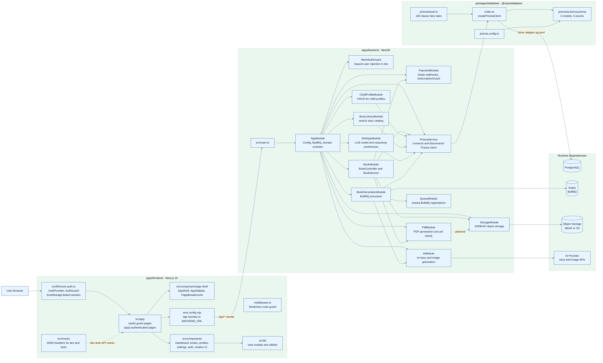
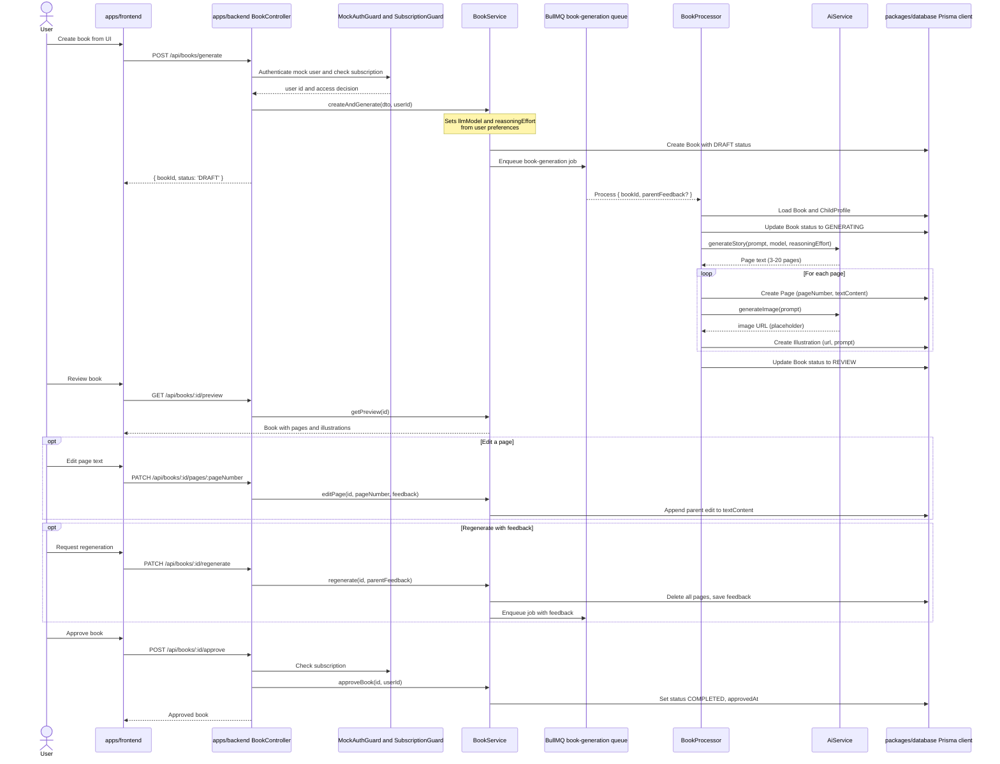
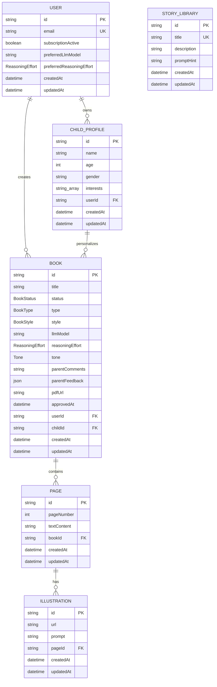

# Project Directory Architecture

Mermaid diagrams for the three primary project directories:

- `apps/frontend` - Next.js 16 application
- `apps/backend` - NestJS API and background workers
- `packages/database` - Prisma schema and client factory

## Runtime Containers

## Main Book Flow

## Book Endpoints

| Endpoint | Method | Guards | Description |
|----------|--------|--------|-------------|
| `GET /books` | GET | MockAuthGuard | Paginated list with filters (title, style, status, childId) |
| `POST /books/generate` | POST | MockAuthGuard + SubscriptionGuard | Create book and enqueue generation |
| `GET /books/:id` | GET | MockAuthGuard | Book detail with child info and all pages |
| `GET /books/:id/preview` | GET | MockAuthGuard | Book with pages and illustrations for review |
| `PATCH /books/:id/pages/:pageNumber` | PATCH | MockAuthGuard | Edit a specific page's text |
| `PATCH /books/:id/regenerate` | PATCH | MockAuthGuard | Delete pages, save feedback, re-enqueue |
| `POST /books/:id/approve` | POST | MockAuthGuard + SubscriptionGuard | REVIEW -> COMPLETED |
| `GET /books/:id/pdf` | GET | MockAuthGuard | Return stored pdfUrl |

## Database Model

### Enums

| Enum | Values |
|------|--------|
| BookStatus | DRAFT, GENERATING, REVIEW, COMPLETED, FAILED |
| BookType | AI_ADAPTED, MANUAL |
| BookStyle | WATERCOLOR, CARTOON, REALISTIC, PIXAR, SKETCH, MANGA, COMIC |
| Tone | WARM, EDUCATIONAL, PLAYFUL, MAGICAL, ADVENTUROUS |
| ReasoningEffort | LOW, MEDIUM, HIGH |

## Frontend Routes

### Route Group: `(auth)` — Guest-only pages

| Route | Component | Description |
|-------|-----------|-------------|
| `/login` | `LoginForm` | Email/password login with demo session |
| `/signup` | `SignupForm` | Name/email/password registration |

### Route Group: `(app)` — Authenticated pages

| Route | Component | Description |
|-------|-----------|-------------|
| `/` | Dashboard | Book library with filters and status summary |
| `/books/new` | CreateBookForm | Book creation with child profile selection |
| `/books/:id` | BookDetail | Completed book view |
| `/books/:id/generating` | GeneratingView | Polling generation status |
| `/books/:id/preview` | PreviewView | Review, approve, edit, or regenerate |
| `/profiles` | ProfilesPage | Child profile CRUD |
| `/settings` | SettingsPage | LLM model and reasoning effort preferences |

### Standalone

| Route | Description |
|-------|-------------|
| `/logout` | Clears session, redirects to `/login` |

## Combined Export View

Single Mermaid block for export in Mermaid Live Editor. This uses one `flowchart`
because Mermaid does not allow `flowchart`, `sequenceDiagram`, and `erDiagram`
syntax to be mixed inside the same diagram block.

```mermaid
---
config:
  theme: base
  themeVariables:
    primaryColor: "#e8f4ff"
    primaryBorderColor: "#1b4d89"
    primaryTextColor: "#172033"
    secondaryColor: "#fff3d8"
    tertiaryColor: "#e9f7ef"
    lineColor: "#667085"
---
flowchart TD
    Browser["User Browser"]

    subgraph Frontend["apps/frontend - Next.js 16"]
        Middleware["middleware.ts"]
        AuthSystem["mock-auth.ts<br/>AuthProvider, AuthGuard"]
        RouteGroups["src/app<br/>(auth) guest pages<br/>(app) authenticated pages"]
        AppShell["AppShell<br/>AppSidebar, PageBreadcrumb"]
        UIComponents["src/components<br/>Dashboard, books, profiles,<br/>settings, auth, shadcn UI"]
        FrontendLib["src/lib<br/>View models and utilities"]
        MSW["src/mocks<br/>MSW handlers for dev and tests"]
        NextConfig["next.config.mjs<br/>/api rewrites to BACKEND_URL"]
    end

    subgraph Backend["apps/backend - NestJS"]
        Main["src/main.ts"]
        AppModule["AppModule<br/>Config, BullMQ, domain modules"]
        Auth["MockAuthGuard<br/>Request user injection in dev"]
        BookModule["BookModule<br/>BookController and BookService"]
        ChildProfileModule["ChildProfileModule<br/>CRUD for child profiles"]
        StoryLibraryModule["StoryLibraryModule<br/>Search story catalog"]
        PaymentModule["PaymentModule<br/>Stripe webhooks, SubscriptionGuard"]
        GenerationModule["BookGenerationModule<br/>BullMQ processor"]
        AiModule["AiModule<br/>AI story and image generation"]
        PdfModule["PdfModule<br/>PDF generation (not yet wired)"]
        StorageModule["StorageModule<br/>S3/MinIO object storage"]
        QueueModule["QueueModule<br/>Shared BullMQ registrations"]
        SettingsModule["SettingsModule<br/>LLM model and reasoning preferences"]
        PrismaService["PrismaService<br/>Connects and disconnects Prisma client"]
    end

    subgraph DatabasePackage["packages/database - @repo/database"]
        PrismaFactory["index.ts<br/>createPrismaClient"]
        PrismaSchema["prisma/schema.prisma<br/>6 models, 5 enums"]
        Seed["prisma/seed.ts<br/>100 classic fairy tales"]
        PrismaConfig["prisma.config.ts"]
    end

    subgraph External["Runtime Dependencies"]
        Postgres[("PostgreSQL")]
        Redis[("Redis<br/>BullMQ")]
        ObjectStorage[("Object Storage<br/>MinIO or S3")]
        AIProvider["AI Provider<br/>Story and image APIs"]
    end

    subgraph BookFlow["Main Book Flow"]
        FlowCreate["1. User creates book in UI"]
        FlowGenerate["2. POST /api/books/generate"]
        FlowGuard["3. MockAuthGuard and SubscriptionGuard<br/>authenticate and authorize"]
        FlowCreateBook["4. BookService creates Book<br/>with DRAFT status"]
        FlowQueue["5. Enqueue book-generation job"]
        FlowWorker["6. BookProcessor loads Book and ChildProfile"]
        FlowGenerating["7. Update status to GENERATING"]
        FlowStory["8. AiService generates story text"]
        FlowPages["9. For each page<br/>create Page, generate illustration,<br/>create Illustration"]
        FlowReview["10. Update Book status to REVIEW"]
        FlowPreview["11. User reviews book<br/>GET /api/books/:id/preview"]
        FlowEdit["12. Optional: edit page text<br/>PATCH /api/books/:id/pages/:pageNumber"]
        FlowRegen["13. Optional: regenerate with feedback<br/>PATCH /api/books/:id/regenerate"]
        FlowApprove["14. User approves book<br/>POST /api/books/:id/approve"]
        FlowComplete["15. Set status COMPLETED, save approvedAt"]
    end

    subgraph DataModel["Database Model"]
        UserModel["USER<br/>id PK<br/>email UK<br/>subscriptionActive<br/>preferredLlmModel<br/>preferredReasoningEffort<br/>createdAt<br/>updatedAt"]
        ChildProfileModel["CHILD_PROFILE<br/>id PK<br/>name<br/>age<br/>gender<br/>interests<br/>userId FK"]
        BookModel["BOOK<br/>id PK<br/>title<br/>status BookStatus<br/>type BookType<br/>style BookStyle<br/>llmModel<br/>reasoningEffort<br/>tone<br/>parentComments<br/>parentFeedback<br/>pdfUrl<br/>approvedAt<br/>userId FK<br/>childId FK"]
        PageModel["PAGE<br/>id PK<br/>pageNumber<br/>textContent<br/>bookId FK"]
        IllustrationModel["ILLUSTRATION<br/>id PK<br/>url<br/>prompt<br/>pageId FK"]
        StoryLibraryModel["STORY_LIBRARY<br/>id PK<br/>title UK<br/>description<br/>promptHint"]
    end

    Browser --> AuthSystem
    AuthSystem --> RouteGroups
    RouteGroups --> AppShell
    RouteGroups --> UIComponents
    UIComponents --> FrontendLib
    RouteGroups --> NextConfig
    NextConfig -->|"/api/* rewrite"| Main
    MSW -. "dev-time API mocks" .-> RouteGroups

    Main --> AppModule
    AppModule --> Auth
    AppModule --> BookModule
    AppModule --> ChildProfileModule
    AppModule --> StoryLibraryModule
    AppModule --> PaymentModule
    AppModule --> GenerationModule
    AppModule --> AiModule
    AppModule --> PdfModule
    AppModule --> StorageModule
    AppModule --> SettingsModule
    AppModule --> PrismaService
    GenerationModule --> QueueModule
    GenerationModule --> Redis
    BookModule --> PaymentModule
    BookModule --> PdfModule
    BookModule --> StorageModule
    BookModule --> PrismaService
    ChildProfileModule --> PrismaService
    StoryLibraryModule --> PrismaService
    SettingsModule --> PrismaService
    GenerationModule --> PrismaService
    GenerationModule --> AiModule
    PdfModule -. "planned" .-> StorageModule
    StorageModule --> ObjectStorage
    AiModule --> AIProvider

    PrismaService --> PrismaFactory
    PrismaFactory --> PrismaSchema
    PrismaFactory -->|driver adapter pg pool| Postgres
    PrismaConfig --> PrismaSchema
    Seed --> PrismaFactory

    FlowCreate --> FlowGenerate --> FlowGuard --> FlowCreateBook --> FlowQueue
    FlowQueue --> FlowWorker --> FlowGenerating --> FlowStory --> FlowPages --> FlowReview
    FlowReview --> FlowPreview
    FlowPreview --> FlowApprove --> FlowComplete
    FlowEdit -. "optional" .-> FlowPreview
    FlowRegen -. "optional re-enqueue" .-> FlowQueue

    FlowGenerate -. "handled by" .-> BookModule
    FlowGuard -. "uses" .-> Auth
    FlowCreateBook -. "writes" .-> BookModel
    FlowQueue -. "uses" .-> QueueModule
    FlowWorker -. "runs in" .-> GenerationModule
    FlowStory -. "uses" .-> AiModule
    FlowPages -. "writes" .-> PageModel
    FlowPages -. "writes" .-> IllustrationModel
    FlowComplete -. "updates" .-> BookModel

    UserModel -->|owns| ChildProfileModel
    UserModel -->|creates| BookModel
    ChildProfileModel -->|personalizes| BookModel
    BookModel -->|contains| PageModel
    PageModel -->|has| IllustrationModel
    StoryLibraryModel -. "independent catalog table" .-> BookModel
```

## Notes

- `apps/frontend/next.config.mjs` rewrites `/api/:path*` to the backend URL, so browser-facing API calls stay relative.
- Frontend auth uses a localStorage-based mock session (`mock-auth.ts`). `AuthProvider` manages session state; `AuthGuard` wraps route groups for guest-only (`mode="guest"`) and authenticated (`mode="authenticated"`) access.
- MSW is initialized in dev mode via `MSWProvider` and provides comprehensive mock handlers for all API endpoints.
- `apps/backend/src/prisma.service.ts` imports `createPrismaClient()` from `@repo/database` and explicitly disconnects it during NestJS shutdown via `OnModuleDestroy`.
- `packages/database/index.ts` creates Prisma with `@prisma/adapter-pg` and a `pg` pool (driver adapters, not binary engine); the schema is the source of the generated Prisma types and enums.
- `StoryLibrary` is an independent lookup/catalog table seeded with 100 classic fairy tales. It has no foreign key relation to `Book`.
- `PdfModule` and `StorageModule` are imported by `BookModule` but PDF generation is **not yet wired** into the approval flow. `approveBook()` sets status to COMPLETED without generating a PDF.
- `SettingsModule` lets users configure their preferred LLM model (validated against `/^[a-z0-9][a-z0-9-]*:[a-z0-9][a-z0-9.-]*$/i`) and reasoning effort. These preferences are stored on the `User` model and applied when creating new books.
- The `BookProcessor` constructs a story prompt incorporating child profile data (age, gender, interests), tone, parent comments, and parent feedback for regeneration. It parses the AI response by splitting on `Page \d+:` patterns.
- `SubscriptionGuard` reads `user-email` header, looks up the user in the database, and checks `subscriptionActive`. It is applied to `POST /books/generate` and `POST /books/:id/approve`.
- `MockAuthGuard` injects a hardcoded mock user `{ id: 'mock-user-id', email: 'mock@example.com', name: 'Mock User' }` when `MOCK_AUTH='true'`. No real authentication is implemented yet.
